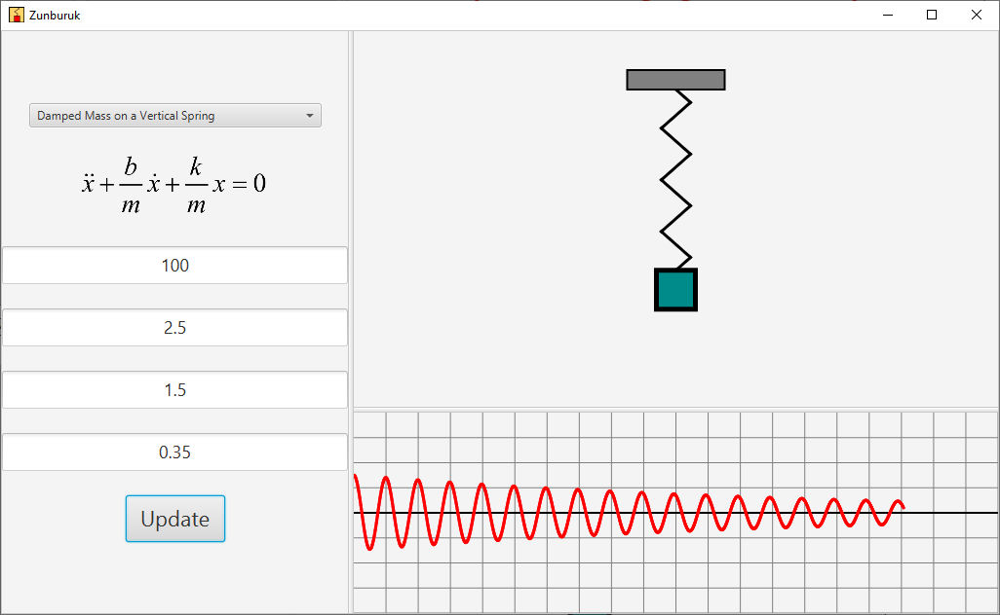

# Zunburuk: simple harmonic motion visualizer
Zunburuk (زنبرك, meaning "spring") is an interactive demonstration of various vibrational, oscillatory or harmonic phenomena. 
You can set pendulums in motion, combine two different waves to produce sound (please lower your speakers' volume), 
or draw pretty Lissajous curves etc... You can manipulate the various parameters that characterize an oscillatory system.

Zunburuk is written mostly in Java with JavaFX graphics, It uses a Runge-Kutta solver which was written in Kotlin.

Not super accurate if you use excessively large parameters... If you find a discrepancy
between what you see here and what you see on a book, I'd trust the book instead.

To download, go to the latest release tag on the right and select the asset you want.
